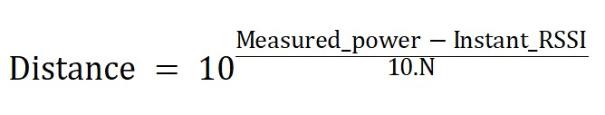
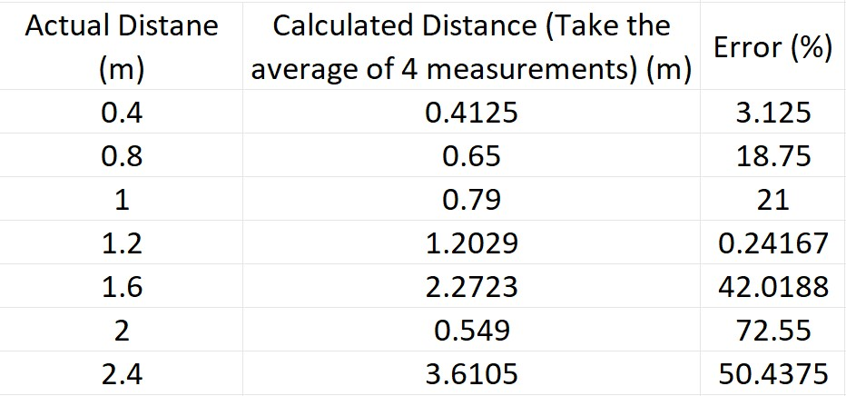

# ESP32_Distance-Measurement-with-RSSI_ver2
Made by @ElectricalThinking29

# Description
+ This project is made to program ESP32-DevKitC board be an Access Point (AP) broadcast Wifi and ESP32-S2 Mini board be a Station read RSSI of the broadcasting AP
+ The purpose is to estimate distance to the AP using RSSI's value read by the Station using the Formula below.
  
+ This project is made from PlatformIO on VS Code

# Youtube Channel
+ You can watch this project's video on Youtube: [Here](https://youtu.be/N62Irjk3XK8)
+ If you can, please support me on my Youtube's channel: @ElectricalThinking29.

# How to use
+ First, you need an ESP32-DevKitC board and configure your IDE (Arduino IDE or PlatformIO) to be able to program it. You can consult the configuration for ESP32-DevKitC if you are using PlatformIO [here](ESP32DevKitC_AP/platformio.ini)
+ In the [ESP32DevKitC_AP](ESP32DevKitC_AP), you will see the [main](ESP32DevKitC_AP/main.cpp) file, use it wisely.
+ Second, you need an ESP32-S2 Mini board and configure your IDE (Arduino IDE or PlatformIO) to be able to program it. You can consult the configuration for ESP32-S2 Mini if you are using PlatformIO [here](ESP32S2Mini_Sta/platformio.ini)
+ In the [ESP32S2Mini_Sta](ESP32S2Mini_Sta), you will see the 2 "main" files: [main_Read-RSSI](ESP32S2Mini_Sta/main_Read-RSSI.cpp) and [main_Read-RSSI-and-Calculate-distance](ESP32S2Mini_Sta/main_Read-RSSI-and-Calculate-distance.cpp).
+ The [main_Read-RSSI](ESP32S2Mini_Sta/main_Read-RSSI.cpp) is for reading RSSI only, you will use it to read the milestone RSSI's values.
+ The [main_Read-RSSI-and-Calculate-distance](ESP32S2Mini_Sta/main_Read-RSSI-and-Calculate-distance.cpp) is for reading any RSSI's value and using the formula to calculate distance. There are two factors: N (environmental coefficient) and measuredPower (RSSI measured at 1m distance) that you need to measure and calculate.
+ You don't have to use exactly those 2 board, you can modify the configuration for the boards you have

# Results
+ I conducted this experiment indoors. The results can be summarized as follows:
 

> **My assess**
> + The error is just too large and unpredictable.
> + I used the ESP32 without any additional signal support devices (like antennas), it means that I use ESP32's flat on-board PCB antenna and I have to place 2 boards face to face. So may be the heading was slightly off and affect the result. (But I hardly doubt that)
> + The space used in the experiment is not good enough. There might be some noise from my neighbor's phone and WiFi router that could affect the measurement. Also, the wall, floor and ceiling might just be too signal-reflective that can cause serious multipath-fading and affect the result.
> + Conclusion, though it seem using RSSI to determine distance is a good idea and theoretically is possible (due to the fact that "the farther the distance, the weaker the signal will be") but there is too many difficulty so that to me it is impossible.

# Contact
+ E-mail: electricalthinking29@gmail.com

# License
Copyright 2023 @ElectricalThinking29

Licensed under the Apache License, Version 2.0 (the "License");
you may not use this file except in compliance with the License.
You may obtain a copy of the License at

    http://www.apache.org/licenses/LICENSE-2.0

Unless required by applicable law or agreed to in writing, software
distributed under the License is distributed on an "AS IS" BASIS,
WITHOUT WARRANTIES OR CONDITIONS OF ANY KIND, either express or implied.
See the License for the specific language governing permissions and
limitations under the License.
